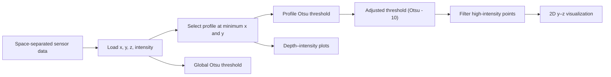

# Depth–Intensity Profile Analysis

A small exploratory Python script for inspecting depth and intensity measurements from a structured 3D sensor dataset.

> [!NOTE]
> Despite the repository name, the current implementation does **not** use the [Open3D](https://www.open3d.org/) library. It operates on tabular measurements with pandas, NumPy, OpenCV, and Matplotlib.

## Overview

The script loads a space-separated point/profile file, selects the profile at the minimum `x` and `y` coordinates, estimates intensity thresholds with Otsu's method, and visualizes the resulting depth–intensity signals and filtered points.



## Repository Contents

```text
.
├── main.py           # Analysis and interactive visualization
├── requirements.txt  # Direct Python dependencies
└── .gitignore        # Local data, results, and development artifacts
```

## Input Data

The active script expects a headerless, space-separated text file with four columns:

| Column | Name | Meaning |
| --- | --- | --- |
| 1 | `x` | First spatial coordinate |
| 2 | `y` | Second spatial coordinate |
| 3 | `z` | Depth or height value |
| 4 | `i` | Intensity value |

The current path is hard-coded in `main.py`:

```python
TestData/3_in5_k3.txt
```

Place the expected file at that location, or update the path before running the script. `TestData/` is intentionally excluded from version control because the original dataset is not included in this repository.

## Installation

Python 3.9 or newer is recommended.

```bash
python -m venv .venv
```

Activate the environment, then install the direct dependencies:

```bash
python -m pip install -r requirements.txt
```

Dependency versions are intentionally unpinned because the original development environment was not recorded.

## Usage

Run the exploratory analysis from the repository root:

```bash
python main.py
```

The script opens interactive Matplotlib windows for:

1. the selected depth–intensity profile;
2. global, profile-specific, and adjusted threshold comparisons;
3. a filtered `y`–`z` view of high-intensity points.

No files are currently written to disk.

## Current Analysis Steps

- Load the sensor measurements into a pandas DataFrame.
- Select rows at the minimum observed `x` and `y` coordinates.
- Compute an Otsu threshold over all intensity values.
- Compute a second Otsu threshold for the selected profile.
- Apply an experimental offset of `-10` to the profile threshold.
- Filter points using the adjusted threshold and display the result.

A disabled legacy block in `main.py` contains additional CSV preprocessing experiments, including missing-depth filling, Gaussian smoothing, and depth adjustment. It is preserved as historical work and is not executed.

## Known Limitations

- The input path is hard-coded and no command-line interface is provided.
- The repository does not include sample data, tests, or a recorded reference environment.
- Coordinate selection relies on exact floating-point equality.
- Intensity values are converted between `uint16` and `uint8`; values outside the 8-bit range may be truncated or wrapped.
- The experimental `threshold - 10` adjustment is not range-checked or documented with sensor calibration units.
- The imported DBSCAN implementation is not used by the active analysis.
- The disabled preprocessing block uses legacy pandas patterns and has not been validated with current pandas releases.
- Results are shown interactively but are not exported.
- The method and expected output could not be reproduced without the original dataset.

## Suggested Next Steps

- Add command-line arguments for input path, coordinate selection, threshold offset, and output directory.
- Define sensor units and validate the accepted intensity range.
- Separate data loading, thresholding, and plotting into testable functions.
- Include a small redistributable sample or synthetic fixture.
- Save plots and processed measurements for reproducible comparisons.
- Rename the repository if Open3D integration is not planned, or add an explicit Open3D-based visualization stage.

## License

No license has been declared. Unless a license is added, the repository remains under the default copyright protections and reuse permission is not granted.
